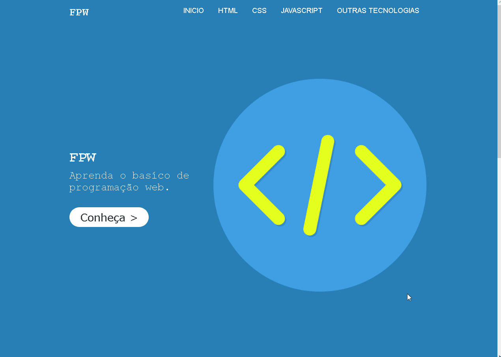

# API1 - Introdução a aplicações Web
<p>Desenvolvendo um blog para ensinar programação web.<p>
<p>Isso é um trabalho do primeiro período da faculdade de análise e desenvolvimento de sistemas, o professor pediu para criar um site com o tema de educação.<p>
<br>
<br>
<h3>Site em desenvolvimento<h3>

# Tecnologias utilizadas:
- [✔️] HTML
- [✔️] CSS
- [✔️] JAVASCRIPT.


<h1>
    
</h1>

# Como vê o site
<strong>Clone o repositório <strong>
```bash
$ git clone https://github.com/Nil-ton/ap1---Introdu-o-a-aplica-es-web.git
```
<strong>Abra o arquivo index.html<strong>
